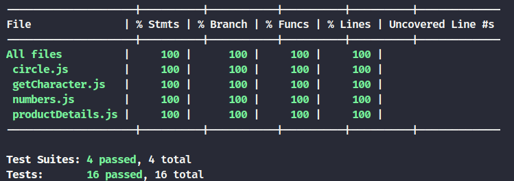

# Projeto Unit Tests 🚀

Este repositório do repositório **Unit Tests** da Trybe contém implementaração de testes para funções javascript usando a biblioteca Jest.  

## 🛠️ Tecnologias e Conceitos Utilizados
- Código **adere aos requisitos** e se comporta como especificado.
- **Organização do código** em funções pequenas simples bendefinidas.
- Página **HTML estruturada** com as tags corretas nos contextos apropriados
- **Escrita e cobertura** de **testes automatizados** para reforçar a confiabilidade do código.

## ✅ Funções Implementadas
### Requisitos do Projeto
 - Implementação da função `average`<br>
 - Implementação dos casos de teste para a função `numbers`<br>
 - Implementação da função `vqv`<br>
 - Implementação dos casos de teste para a função `circle`<br>
 - Implementação da função `createStudent`<br>
 - Implementação dos casos de teste para a função `productDetails`<br>
 - Implementação das funções `calculator` e `arrayGenerator`<br>
 - Implementação da função `myCounter`<br>
 - Implementação dos casos de teste para a função `getCharacter`<br>


## 📁 Estrutura do Projeto
src/  
 ├── average.js  
 ├── circle.js  
 ├── createStudent.js  
 ├── getCharacter.js  
 ├── myCounter.js  
 ├── numbers.js  
 ├── productDetails.js  
 └── vqv.js  
tests/                      # testes implementados no exercício
 ├── circle.spec.js  
 ├── getCharacter.spec.js  
 ├── numbers.spec.js  
 └── productDetails.spec.js  


## ▶️ Como Executar o Projeto

#### Clone o repositório.
```bash
git clone git@github.com:CalebeLAR/trybe_05_unit_tests.git
```

#### instale as dependências.
```bash
npm install
```

#### rode os testes
```bash
npm test
```



### 🤝 Contribuição
Este é um projeto desenvolvido individuamente como parte do curso de Desenvolvimento Web da Trybe. Pull requests não serão aceitos, mas feedbacks são sempre bem-vindos!